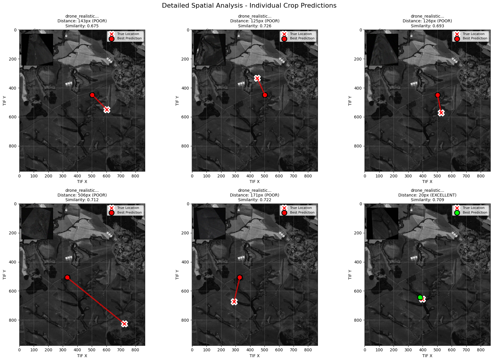

# mdkontroller-vision_match_poc: DroneLocator AI System

This repository contains the original field-built prototype, developed under extreme time and resource constraints during the European Defense Hackathon Lviv 2025.  
Code is intentionally unpolished and preserved as-is to reflect real-world integration work done under pressure those days.

# What this is
Offline UAV geolocation prototype using visual footage from interceted drone camera.

# Why it looks this way
Built in 48 hours under field conditions (air-raid alarms, lack of sleep). Focused entirely on working inference, not code style.

# How it works (conceptually)
(Drone) Camera → Gray scale normalization → RL Agent based map search → Estimated location probilities


## 🚀 Overview


The **mdkontroller-vision\_match\_poc** (Proof-of-Concept) repository houses the core components and a comprehensive demonstration suite for the **DroneLocator AI System**. This system is designed to accurately determine a drone's ground location by matching its real-time aerial imagery with large-scale satellite imagery.

The approach integrates traditional computer vision techniques, specifically **SIFT (Scale-Invariant Feature Transform)**, with advanced **Reinforcement Learning (RL)** to achieve high-accuracy, scalable, and efficient localization, even under varying perspectives and large search areas.

---

## 🎯 Key Capabilities Demonstrated in `demo_comprehensive.py`

The project's main script, `demo_comprehensive.py`, serves as a complete demonstration suite, showcasing the following advanced features:

1.  **Advanced SIFT Feature Matching:** Core visual-inertial localization. This module is demonstrated across multiple scenarios to test resilience to rotation, lighting, and perspective changes.
2.  **Reinforcement Learning (RL) Agent:** An agent trained for intelligent search path planning and optimal localization, providing superior search efficiency compared to brute-force methods.
3.  **Dynamic Large-Area Search:** The ability to efficiently locate a drone's field-of-view within massive geographical areas, proving the system's scalability.
4.  **Realistic Drone Perspective Simulation:** Modules for generating and handling images under realistic drone perspectives (oblique angles, varying altitude, atmospheric haze) to ensure robust performance in real-world conditions.
5.  **Interactive Mapping & Visualization:** Creation of detailed plots, charts, and interactive maps (using libraries like `matplotlib` and `folium`) for performance analysis and result visualization.
6.  **Comprehensive Performance Analytics:** Detailed metrics on accuracy ($\text{F1 Score}$, $\text{Precision}$, $\text{Recall}$), processing speed, and scalability are calculated and visualized.

---

## 📁 Repository Structure

The repository is organized into modules for data preparation/analysis and the RL agent's training/validation.


---

## 🛠️ Getting Started

### Prerequisites

To run the comprehensive demo, you need Python 3.x and the necessary libraries.

1.  **Clone the repository:**
    ```bash
    git clone https://github.com/MDkontroller/Vision_match_PoC
    cd mdkontroller-vision_match_poc
    ```

2.  **Install dependencies:**
    The project relies on standard scientific computing and computer vision libraries.
    ```bash
    pip install -r requirements.txt
    ```

### Running the Comprehensive Demo

Execute the main script to run all four demos, generate performance metrics, visualizations (saved to the newly created `website_assets/` directory), and launch a mock web browser summary.

```bash
python demo_comprehensive.py 
```

### Results


The results show that the agent is able to predict possible locations with high visual similarity to the ground truth, including transitions between agricultural paths and forest regions.
Although the predicted locations are often far from the true position, this experiment highlights both the potential and limitations of the current approach.
In one case, the agent successfully matched a dataset sample with strong similarity, suggesting that reinforcement learning could achieve reliable matches if the right policies and data sampling strategies are refined.
Future work will focus on more efficient representations of the input as 2D–3D vector embeddings and on developing a dynamic strategy for matching.

### License 
This project is released under the MIT License.
